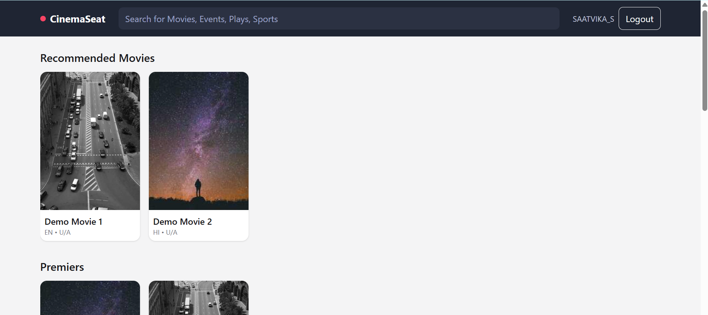
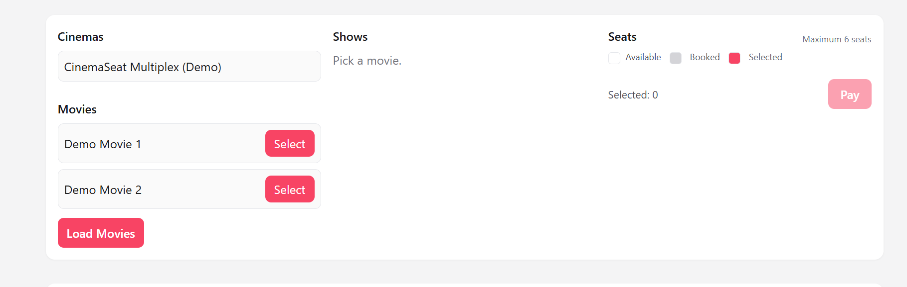
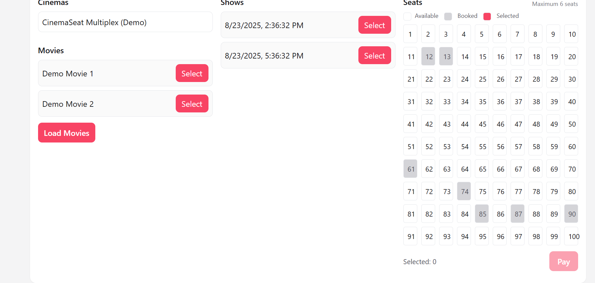
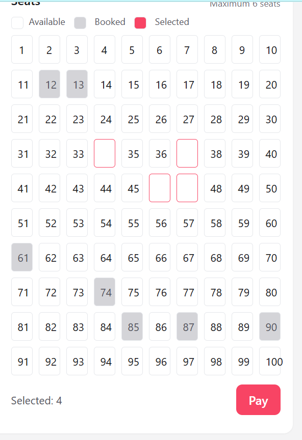
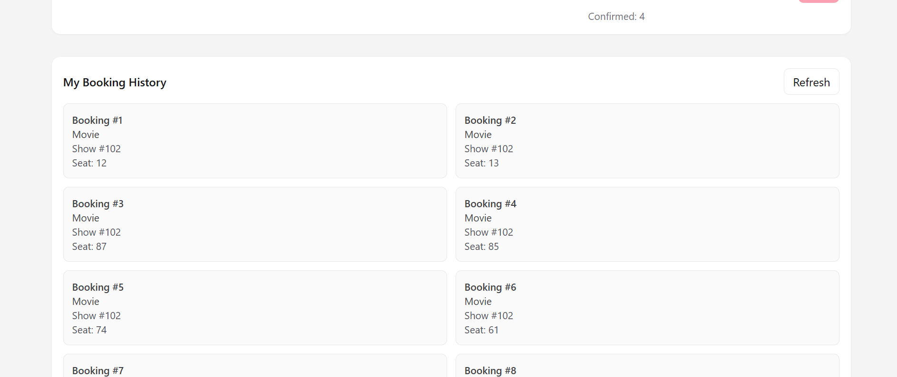

# CinemaSeat

CinemaSeat is a BookMyShow-style cinema booking application.  
Backend is built with Django REST Framework and JWT authentication.  
Frontend is a plain HTML/CSS/JavaScript page styled with Tailwind (CDN).

---

## Tech Stack

- Python, Django, Django REST Framework
- JWT auth with `djangorestframework-simplejwt`
- SQLite by default (can switch to MySQL/PostgreSQL)
- Frontend: HTML + TailwindCSS (CDN) + vanilla JavaScript (Fetch API)

---

## Project Structure

CinemaSeat/
├─ backend/
│ ├─ backend/ # Django project
│ ├─ cinema/ # Movies, shows, seats, bookings API
│ ├─ users/ # Auth-lite helpers (/me, register if enabled)
│ ├─ manage.py
│ └─ requirements.txt
├─ frontend/
│ ├─ index.html # UI
│ └─ app.js # Frontend logic
├─ screenshots/
├─ .gitignore
└─ README.md

---

## How to Run Locally

### Prerequisites

- Python 3.10+
- Git
- Internet access for Tailwind CDN (or replace with local build)

### 1) Clone the repository

```bash
git clone https://github.com/7veekaa/CinemaSeat.git
cd CinemaSeat
```

cd backend
python -m venv venv
venv\Scripts\activate
pip install -r requirements.txt
python manage.py migrate
python manage.py runserver 8000

Backend runs at:
http://127.0.0.1:8000

3. Frontend setup

From project root:

cd frontend
python -m http.server 5500

Frontend runs at:
http://127.0.0.1:5500/index.html
API Endpoints

POST /api/auth/token/

POST /api/auth/token/refresh/

GET /api/users/me/

GET /api/cinema/movies/

GET /api/cinema/movies/:id/shows/

GET /api/cinema/shows/:id/seats/

POST /api/cinema/bookings/

GET /api/cinema/my-bookings/

Frontend Flow

Login with Sign In button (JWT auth).

Load Movies → select a movie → pick a show.

Select up to 6 seats.

Click Pay → booking confirmed.

Booking History shows your past bookings.

Troubleshooting

401 → token missing/expired → login again.

404 → check URL and trailing slashes.

CORS errors → ensure corsheaders in INSTALLED_APPS + CORS_ALLOW_ALL_ORIGINS=True (dev).

Empty bookings → login required for /api/cinema/my-bookings/.

## Screenshots

### Home (Logged In)



### Movies Review



### Booking Process



### Seat Selection



### Booking Confirmation


